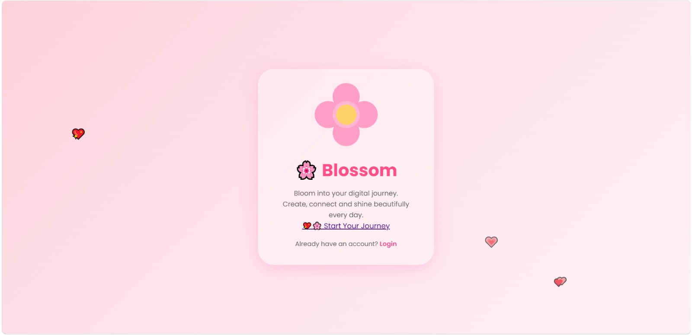
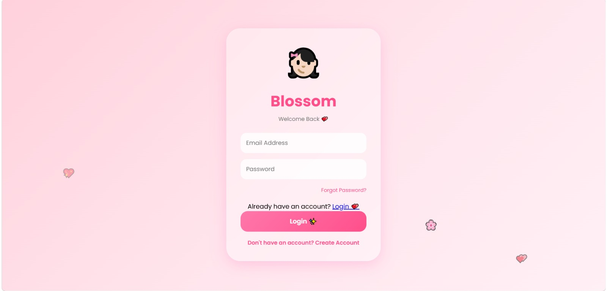

# CodSoft-Design-Portfolio_127
A UI/UX design project for a 3-screen mobile app signup flow (Signup, Registration, Success) 

About this project🚀🛸

This project is a simple mobile app signup flow created to make the account creation process easy and user-friendly. The design includes a Signup page for new users, a Login page for existing users, and a Success page that appears after successful account creation.
Users can register by entering their name, email, and password. After creating an account, they can log in and access the application. The interface is designed to be clean, simple, and easy to understand for all users.

Screens Included
Welcome & Sign Up Screen
Login Screen
Account Created Successfully Screen
Tools Used
HTML
CSS
Purpose
(The main goal of this project is to create a simple and attractive user authentication flow while improving frontend design and layout skills.)

##  Screenshots of this Projects

## Sign Page

### Welcome Pagewelcome

## User Flow

Welcome Page → Login Page → Success Page
(This clearly shows how users move through your project. 🚀) 

## Live Demo

View the live project here:

🔗https://capable-babka-a957cd.netlify.app/

🛸#Author -Himani Rana

