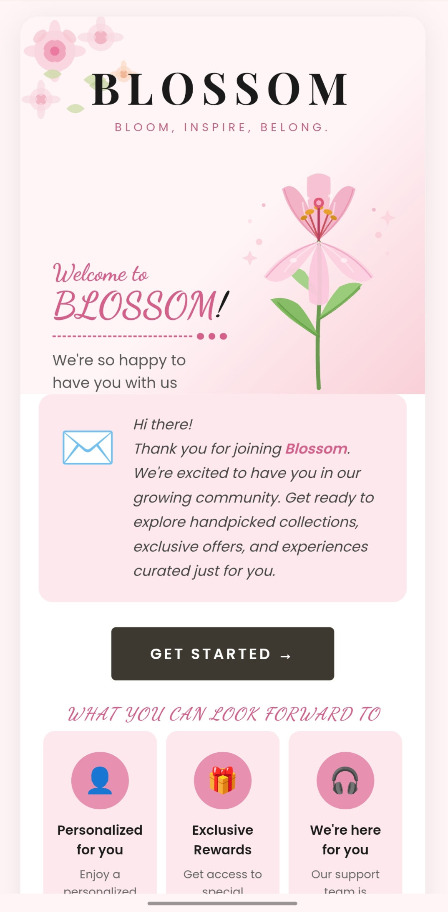
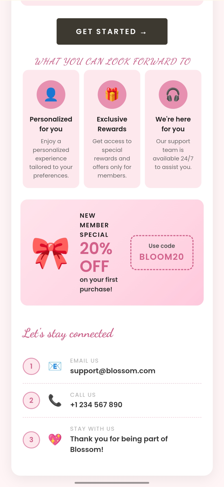

📧 ##Email Template Design

✨ ##CodSoft Internship - Task 2

Welcome to my Email Template Design Project! This project was created as part of the CodSoft Internship Program to showcase both my creative designing skills and front-end development skills.

---

🎯 ##Project Description

The aim of this project was to design a professional and visually appealing email template that can be used for marketing campaigns, newsletters, promotions, announcements, and business communication.

To make this project more effective, I created it in two different versions:

🎨 ##Canva Design Version

A beautifully designed email template created using Canva with a modern layout, attractive typography, and visually engaging elements.

💻 ##HTML & CSS Version

The same email template was developed using HTML and CSS to demonstrate coding skills, responsive design techniques, and structured web development.

👾Preview of Project

🚀Design using [HTML and CSS]

 
 
 🚀Design using [Canva]
 

---

🚀 ##Key Features

✅ Clean & Modern Design
✅ Professional Email Layout
✅ Attractive Typography
✅ User-Friendly Structure
✅ Responsive Design
✅ Organized Content Sections
✅ Creative Visual Presentation

---

🛠️ ##Technologies Used

- 🎨 Canva
- 🌐 HTML5
- 🎯 CSS3
---
📚 ##Learning Outcomes

Through this project, I improved my skills in:

- UI/UX Design
- Email Template Design
- HTML Development
- CSS Styling
- Responsive Web Design
- Creative Thinking

---

👩‍💻 ##Author

Himani Rana

💼 Internship Program

CodSoft Internship

---

⭐ Thank you for visiting my project repository. Your feedback and suggestions are always appreciated!
